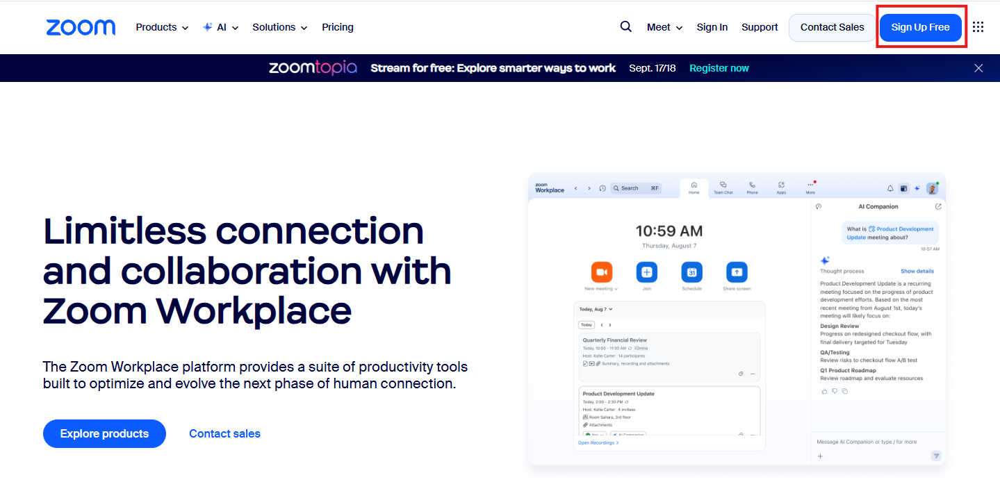
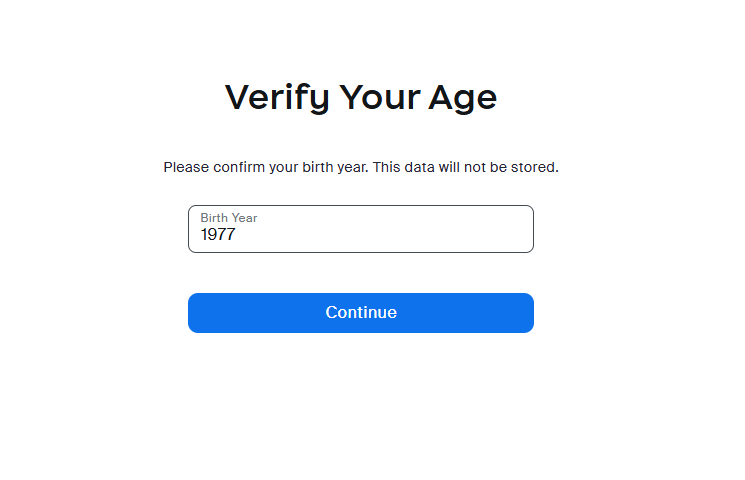
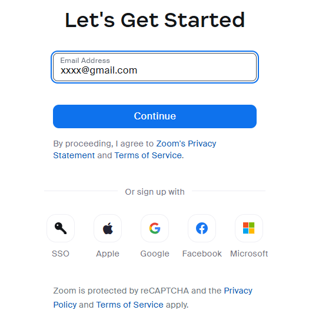
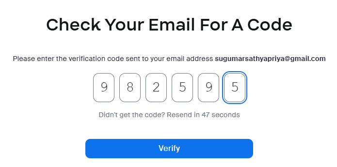
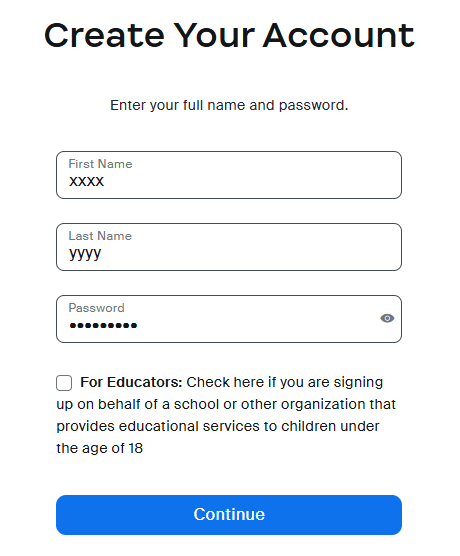

# How to create a Free account in Zoom 

To create a free Zoom account, follow the step-by-step instructions given below: 

1. Go to  [www.zoom.com](https://www.zoom.com)
2. Click on the **Sign Up Free** button on the top-right side of the page.
   
3. Enter your birth year. Click **Continue**.  

5. Enter your email address. Click **Continue**. 

6. Enter the verification code sent to your email address. Click **Verify**.  
 
7. Enter your full name and set a new passowrd. Click **Verify**.  

8. Click **Continue** to finish creating your account.

<h2><b>Frequently asked Questions</b></h2>

### 1. How do I sign up for Zoom?
You can sign up for a free Zoom account at [www.zoom.com](https://www.zoom.com)

### 2. How much does Zoom cost?
A basic Zoom license is free. 

### 3. How do I join a Zoom meeting?

You can join a meeting by clicking the meeting link or going to [join.zoom.us](https://join.zoom.us) and entering in the meeting ID.     

